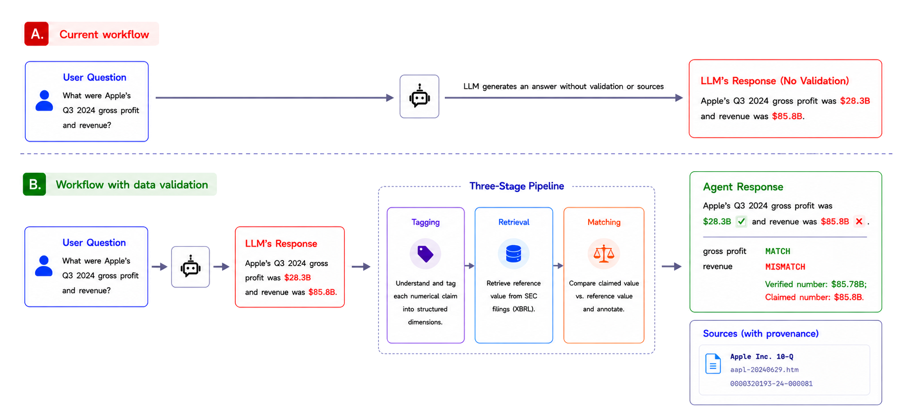

XBRL Validation Pipeline
========================

.. admonition:: TL;DR
   :class: note

   Agentic FinSearch ships with a deterministic, user-triggered pipeline that
   checks the numerical claims in any agent response against SEC XBRL filings.
   Click **Validate** below a response to get a per-claim verdict (``Verified``,
   ``Mismatch``, ``Skipped``, ``Not Applicable``) and the exact filing used as
   ground truth, surfaced inside the existing **Sources** popup.

Overview
--------

Accurate retrieval of real-time financial data is a core piece of infrastructure
for AI agents that answer financial questions. Agent-generated financial text
still contains numerical claims that a user cannot verify at a glance — a
``$12.3 billion`` revenue figure and an ``18%`` growth rate shown in the same
paragraph look equally authoritative whether one, both, or neither are grounded
in an SEC filing.

The XBRL Validation Pipeline closes that gap. It is a three-stage process —
**tagging → retrieval → matching** — that operates on the agent's response,
not on the upstream tool calls. Every claim that the pipeline processes
emerges with a verification badge inline in the response and a citation to the
original filing in the Sources popup.

   *Top:* baseline LLM workflow — the model emits numerical claims without
   validation or provenance. *Bottom:* the same response routed through the
   three-stage pipeline. Each claim is tagged against US-GAAP, the reference
   value is retrieved from SEC filings, and the result is annotated in the
   response with provenance shown in the Sources popup.

The Verification Problem
------------------------

Large language models generate financial text fluently, but their numerical
claims are often wrong. Retrieval-augmented pipelines reduce — but do not
eliminate — the failure. In production, a user reading a FinAgent response has
no way to tell which numbers are grounded in a real SEC filing and which were
fabricated. The model speaks all numbers with equal confidence.

Agentic FinSearch already surfaces source filings in its Sources popup, but
that does not verify *individual* numerical claims. A user who wants to audit
a specific figure today must open the filing, search for the relevant line
item, and cross-check by hand. For an agent that produces dozens of numerical
claims per response, that workflow is not realistic.

The concrete gaps the pipeline closes:

* No automatic check of individual numerical claims against SEC filings.
* No per-claim visual indicator inside the response text.
* No reusable verification primitive that other FinAgent prototypes can adopt.

Three Stages
------------

The pipeline takes an AI-generated financial claim as input and returns the
same claim annotated with a verification badge. Each stage is a
single-responsibility module — decoupled, independently testable, and reusable
by other FinAgent prototypes.

Stage 1: Tag the Claim
~~~~~~~~~~~~~~~~~~~~~~

A natural-language claim such as *"Apple's Q3 2024 gross profit was $28.3 billion"*
is decomposed into six structured dimensions:

* **entity** — CIK and ticker
* **concept** — US-GAAP tag
* **period** — ISO 8601 instant or duration
* **unit** — currency and scale
* **context** — segment or dimension
* **value**

The ``concept`` field is filled by the XBRL tagging module, which performs
retrieval-then-select over the FASB 2026 US-GAAP taxonomy so the agent never
fabricates tag names. The output is a structured record that any
XBRL-compliant store can resolve.

Stage 2: Retrieve the Reference Value
~~~~~~~~~~~~~~~~~~~~~~~~~~~~~~~~~~~~~

Given a tagged record, Stage 2 looks up the reference value from an
authoritative SEC source. Today's implementation reads from a small local
index of XBRL filings shipped inside the repository at
``Main/backend/mcp_server/xbrl/filings/``.

.. admonition:: Coverage today
   :class: important

   Validation currently resolves against **three pre-loaded SEC filings**:
   Apple (FY2023, ``aapl-20230930.xml``), Microsoft (FY2023,
   ``msft-20230630.xml``), and Tesla (FY2023, ``tsla-20231231.xml``). Claims
   about any other ticker or period return ``Skipped`` with a "filing not
   found" reason. Expanding this set is the focus of the upcoming
   :ref:`SEC XBRL Filing Tree <xbrl-filing-tree>` work.

The return value is a tuple of *(value, filing accession, filing date)*.

Stage 3: Match and Annotate
~~~~~~~~~~~~~~~~~~~~~~~~~~~

Stage 3 compares the tagged claim value against the reference value:

* A match within tolerance is marked **Verified** (green ✓).
* A clear mismatch is marked **Mismatch** (red ✗), with the variance percentage.
* A claim that cannot be resolved (missing tag, missing filing, unit mismatch)
  is marked **Skipped**, and the reason is surfaced to the user.
* A claim whose metric is not defined for the filing (e.g., current ratio on an
  unclassified balance sheet) is marked **Not Applicable**.

Every result — including ``Skipped`` and ``Not Applicable`` — carries the
filing accession and filing date as provenance, both inline in the response
and inside the Sources popup.

Using Validate
--------------

1. **Ask a financial question** that elicits a ratio or balance-sheet figure,
   for example: *"What was Apple's gross margin for FY2023?"* or
   *"Summarize Tesla's Q4 2023 balance sheet."*
2. After the response renders, a **Validate** button appears in the response
   toolbar **only if the response emitted at least one supported claim**. If
   the response did not contain a verifiable numerical claim, the button is
   hidden.
3. **Click Validate.** The pipeline runs deterministically on the claims the
   agent emitted — no second LLM pass — and returns one verdict per claim.
4. **Read the verdict chips** rendered just below the response. Mismatches are
   underlined in red inline so you can locate the offending number in the
   prose without scanning.
5. **Open the Sources popup** to see the XBRL filings used as ground truth,
   grouped under a new ``Ground Truth`` subsection alongside any other sources
   the agent cited.

Verdict Statuses
----------------

.. list-table::
   :header-rows: 1
   :widths: 18 12 70

   * - Status
     - Badge
     - Meaning
   * - **Verified**
     - ✓ green
     - The claimed value matches the value in the filing within tolerance
       (``max(0.01% of |expected|, 0.005)``). The XBRL filing path is appended
       to the Sources popup.
   * - **Mismatch**
     - ✗ red
     - The claimed value differs from the filing value by more than tolerance.
       The variance percentage is shown on the chip; the claimed number is
       underlined in red inline.
   * - **Skipped**
     - — gray
     - The ratio could not be evaluated — typically because a required US-GAAP
       tag was missing from the filing, the period did not resolve, or the
       unit was incompatible. The chip surfaces the reason.
   * - **Not Applicable**
     - ⊘ slate
     - The ratio is undefined for this filer. Example: ``current_ratio`` on an
       unclassified balance sheet (banks, insurance, REITs typically lack
       ``AssetsCurrent``). The pipeline detects this deterministically rather
       than emitting a spurious failure.

Current Implementation (Layer 1 MVP)
------------------------------------

The pipeline in production today is the **Layer 1 MVP**: three accounting
identities, evaluated against local XBRL filings, triggered by the user.

.. list-table::
   :header-rows: 1
   :widths: 30 35 35

   * - Equation
     - Family
     - Sample demo question
   * - ``Assets = Liabilities + Equity``
     - Accounting identity
     - *"Summarize Tesla's Q4 2023 balance sheet."*
   * - ``Gross Margin = (Revenue − COGS) / Revenue``
     - Profitability
     - *"What was Apple's gross margin for FY2023?"*
   * - ``Current Ratio = Current Assets / Current Liabilities``
     - Liquidity
     - *"What is Microsoft's current ratio as of FY2023?"*

The accounting identity is evaluated as ``A = L + TempEquity + E`` so that
filers with redeemable non-controlling interests (e.g., Tesla) verify cleanly
— omitting ``TempEquity`` produces a spurious ``0.2%`` failure on otherwise
valid data. For filers without NCI (Apple, Microsoft), ``TempEquity`` defaults
to zero.

Why "Layer 1"? The pipeline is the first layer of the FinSearch four-layer
architecture. Each layer expands the validation surface — Layer 2 adds
runtime claim harnessing across long-form reports, Layer 3 grafts the pipeline
into XBRL-grounded sandboxes, and Layer 4 hosts the whole stack as cloud-native
Financial Truth Infrastructure.

Roadmap
-------

The module boundary is stable; the surface widens on a defined schedule.

.. _xbrl-filing-tree:

* **SEC XBRL Filing Tree (cloud).** The most visible limitation today is that
  only three filings are bundled with the backend. The next major workstream
  is a **cloud-hosted SEC XBRL Filing Tree** — a structured, query-friendly
  index of XBRL filings keyed by ``(ticker, period, statement)`` — that any
  agent can hit over the network without bundling raw filings into the
  repository. Once it ships, the resolver swaps its filesystem lookup for a
  tree query, and validation extends from three tickers to the full universe
  of SEC registrants. The local-filings path remains as the offline
  fallback for development and air-gapped demos.
* **Additional ratios.** Income statement identity, cash flow reconciliation,
  debt-to-equity, return on equity. Each ratio is one tag map and one pure
  function — the engine and resolver do not change.
* **Streaming validation.** Today's Validate is lazy; Layer 2 will surface
  per-claim verdicts as the response streams.
* **Coverage benchmark.** Target ≥80% verification coverage on the 24-question
  FinSearch benchmark, where a claim counts as covered if all three stages
  produce any verdict — measured *after* the Filing Tree lifts the
  three-filing coverage ceiling.

Further Reading
---------------

* :doc:`mcp_tools` — the MCP tool surface, including ``query_xbrl_filing``
  and ``report_claim`` that this pipeline uses internally.
* :doc:`api_reference` — the ``/api/axioms/validate/`` and
  ``/api/axioms/has_claims/`` REST endpoints that back the Validate button.
* :doc:`project_structure` — where the ``Main/backend/axioms/`` modules sit
  in the broader backend.

For the engineering design records that accompanied the build, see the
``Docs/superpowers/specs/`` directory:

* ``2026-03-31-xbrl-verification-design.md`` — original 4-step verification
  proposal (filing-vs-contract use case).
* ``2026-04-07-axiom-engine-design.md`` — first axiom (``A = L + E``) with the
  tool-wrapper intercept approach. Superseded by the user-triggered Validate
  design below but kept for history.
* ``2026-04-13-numbers-ratios-layer-design.md`` — the design that shipped:
  three ratios, ``report_claim`` agent tool, Django claim registry, and the
  Validate REST endpoints.
