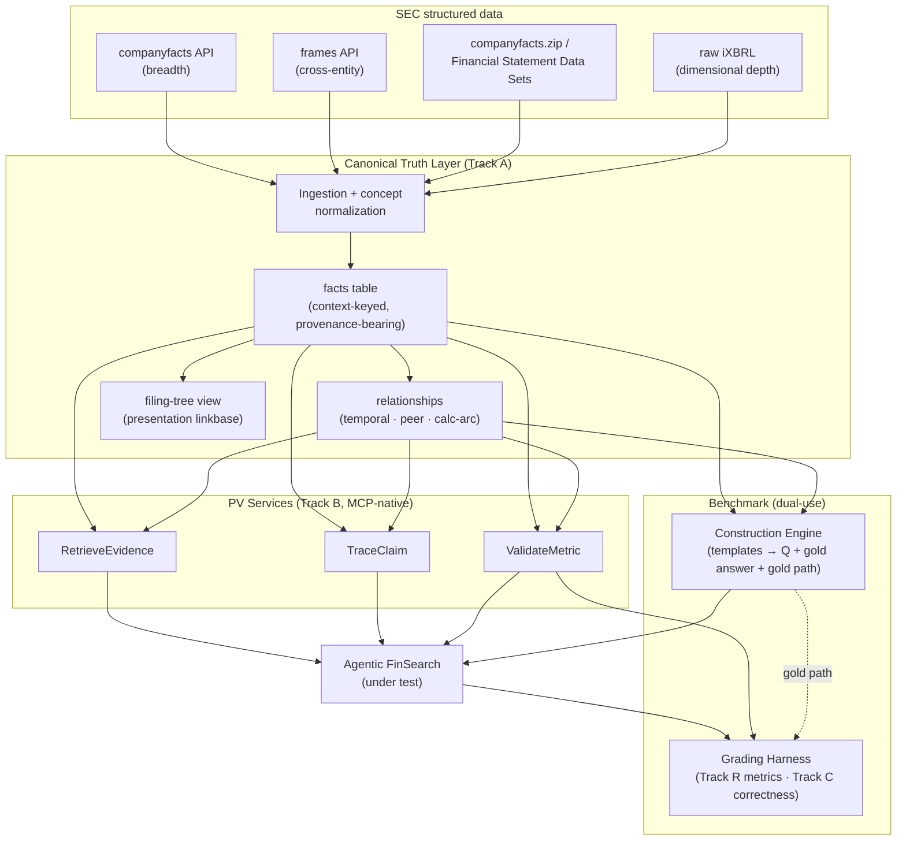

# XBRL Truth Infrastructure → Verifiable FinSearch Benchmark: The Engineering Bridge

**Date:** 2026-05-26
**Status:** Draft for review
**Authors:** Felix Tian (engineering bridge), SecureFinAI Lab
**Scope:** Inward-facing engineering design. Translates the "XBRL Truth Infrastructure" vision (prof's / lab's strategy) into a concrete, phased build sequence on top of the **shipped 3-stage validation pipeline**.

---

## 0. Purpose & framing

This document answers two questions posed by the advisor:

1. **Construct:** Agentic FinSearch + XBRL → how do we build a **Benchmark** for (a) *长程取数 / long-range multi-hop data fetching* and (b) *复杂金融计算 / complex financial computation*?
2. **Verify:** For those tasks, how do we **ensure verifiability**?

It deliberately stays inward-facing. The grand vision and large strategy belong upstream (advisor + the `Financial Truth Infrastructure for AI Agents` drafts). Our job is the bridge: **vision → buildable engineering tasks**, each with a measurable acceptance gate.

### The thesis: the truth infrastructure is dual-use

The draft frames the XBRL Truth Infrastructure as a *verification* layer (catch wrong numbers). The key reframing that organizes this whole design:

> The same canonical-truth-layer + PV services that **verify** agent outputs at runtime are also (a) the grounded substrate agents **retrieve** from, and (b) the ground-truth oracle + grader needed to **benchmark** agents.

One substrate, three jobs: **retrieve · verify · benchmark.** Expressed as a slogan: **"ingest once → validate millions → benchmark rigorously."**

The payoff for the benchmark specifically: **because every question is generated *from* grounded XBRL facts, its gold answer *and* its gold solution-path exist by construction.** That sidesteps the two things that make agent benchmarks expensive and disputable — human answer-keys and LLM-as-judge ambiguity. **Verifiability (Q2) is the generative principle of the benchmark (Q1), not a bolt-on.**

---

## 1. Where we are starting from (shipped pipeline)

The draft's abstract "tagging → retrieval → matching" is, concretely, this shipped stack:

| Shipped component | What it does | Code |
|---|---|---|
| Anti-hallucination **XBRL tagging** | Retrieval-then-select over FASB 2026 US-GAAP taxonomy so the agent never fabricates tag names | `lookup_xbrl_tags`, `validate_xbrl_tag` (MCP) |
| **`query_xbrl_filing`** | Local iXBRL parser; resolves `(company, tag)` → value with period/unit/context; 3–5 local filings (AAPL, MSFT, TSLA, JPM, BRK) | `mcp_server/xbrl/parser.py`, `server.py` |
| **Axiom Engine** | Deterministic `A = L + E` check, code-enforced in the tool wrapper | `axioms/engine.py` |
| **Numbers + Ratios (Layer 1)** | User-triggered "Validate" button; 3 ratios (accounting identity, gross margin, current ratio) checked against local XBRL; inline mismatch marks | `axioms/{engine,resolver,registry}.py`, `report_claim` tool, `/api/axioms/validate/`, Chrome extension |

These sit inside the lab's **FinSearch four-layer architecture**: **L1** numbers+ratios (shipped, 91.7% vs Perplexity 41.7% on the 24-Q benchmark) · **L2** streaming per-claim validation + long-form report tagging · **L3** compliance-as-contract (deferred) · **L4** cross-source / canonical truth.

**The gap to a benchmark:** 3–5 local filings can verify a demo, but cannot *generate or grade* a benchmark across companies and periods. Closing that gap is what pulls the truth layer into existence.

---

## 2. The two benchmark tracks

### Track R — 长程取数 (multi-hop retrieval over XBRL)

- **Task.** A FinSearch agent answers a question requiring *K* grounded facts fetched across multiple hops (conditional lookups, period-over-period, cross-entity comparisons, multi-constraint filters).
  - *Example:* "By how much did Apple's effective tax rate change between the first fiscal year its R&D exceeded $25B and the following year?" → find-the-year → rate(y) → rate(y+1) → Δ.
- **Inputs.** Question + access to FinSearch tools (search, `RetrieveEvidence`).
- **Gold label.** Canonical answer **+ the gold fact-path** (which XBRL facts, in order) — auto-derived from the truth layer at generation time.
- **Metrics (mirroring 同花顺):**
  - **End-to-end task accuracy** (final answer correct).
  - **Per-hop process accuracy** (of *N* hops, how many intermediate facts correct).
  - **Hop-efficiency** (fewer hops to solve is better).
- **Why it matters (measured):** single-hop accuracy is already <80% and *two-hop drops below 50%* (同花顺); FinSearchComp shows monotonic decline T1→T3 (best model Grok-4 68.9% vs human 75.0%); FinAgentBench shows models "degrade sharply at fine-grained chunking due to evidence sparsity." This cliff is the headline result the benchmark measures.

### Track C — 复杂金融计算 (complex computation grounded in XBRL)

- **Task.** The agent **plans and writes** computation logic to derive a quantity/decision from grounded facts — *no pre-built tool for every metric* (tests on-the-fly logic, per 同花顺's "flexibility" challenge + QuantEval's strategy-coding dimension).
- **Inputs.** Question + grounded facts (or the tools to fetch them).
- **Gold label.** Reference result computed deterministically from the *same* grounded inputs; for algorithmic/strategy tasks, **execution-based** via a deterministic harness (QuantEval-style backtest).
- **Metric.** Result correctness within tolerance · executability / internal consistency.
- **Sub-modes.** *Core:* valuation / metric-derivation (e.g. ROIC, DuPont, leverage, coverage from real filing data). *Stretch (Phase-4):* strategy-coding with backtest execution.
- **Why it matters (measured):** QuantEval — even GPT-5 ~55% on quantitative reasoning vs human experts 89%; failures are arithmetic + formula-composition + interface/execution errors. Correctness must be validated by execution, not surface inspection.

---

## 3. The verifiability model (Q2)

Four kinds of verifiability, each a generalization of a pipeline stage we already have. This is the answer to "how do we ensure verifiability":

| # | Verifiability | Means | Generalizes |
|---|---|---|---|
| 1 | **Provenance** | every fact → a specific XBRL fact (`accession, tag, period, unit, context`) | tagging + `query_xbrl_filing` |
| 2 | **Value** | claimed value == authoritative XBRL value within `decimals`-aware tolerance | matching / Numbers-Ratios |
| 3 | **Path** | each hop's intermediate fact independently checkable → process accuracy, not just final | retrieval graph (to build) |
| 4 | **Computation** | derived result re-computable from grounded inputs + axiom consistency; strategy via deterministic execution | Axiom Engine (to generalize) |

The benchmark is **verifiable by construction**: every generated question carries the `fact_id`s it was built from, so its answer (value-verifiable), its solution path (path-verifiable), and any derivation (computation-verifiable) are all gradable deterministically — no manual answer key.

---

## 4. Architecture



---

## 5. Canonical Truth Layer — detailed design

### 5.1 Storage primitive: a context-keyed fact table (not tag→value)

A US-GAAP tag is **not** a unique key. In one Apple 10-K, `RevenueFromContractWithCustomerExcludingAssessedTax` appears ~15+ times — FY2023/2022/2021 comparatives, plus product-line and geographic disaggregations. What disambiguates them is the XBRL **context**. The key is the full context tuple:

```
fact_key   = (cik, concept, period_type, period_start, period_end, unit, dimensions)
fact_value = (value, decimals)  +  provenance
```

Schema (DuckDB locally → Aurora/Neptune in cloud):

```
facts(
  fact_id,                       -- hash(context tuple + accession)
  cik, entity_name,
  taxonomy,                      -- us-gaap | dei | ifrs | company-extension
  concept,                       -- the tag
  period_type,                   -- 'instant' | 'duration'
  period_start, period_end,
  unit,                          -- USD | shares | pure | USD/shares
  decimals,                      -- precision → tolerance during matching
  dim_hash, segment_json,        -- dimensional members; NULL = aggregate
  value,
  -- provenance (verifiability + leakage control):
  accession, form_type, filed_date, fy, fp, taxonomy_version, frame
)

filings(accession, cik, form_type, filed_date, period_of_report, primary_doc_url, taxonomy_version)
```

Indexes: `(cik, concept, period_end)` (entity history), `(concept, period_end)` (peer/cross-entity), `(filed_date)` (leakage as-of filtering).

### 5.2 The "filing tree" is a view, not the storage

A fact lives at the intersection of *(entity × concept × period × dimensions)* — four-dimensional; a single tree forces one hierarchy and loses the rest. So **store flat facts; expose the period/time tree and the per-filing statement tree as materialized views/indexes.** The statement tree (Statement → section → line item), derived from the **presentation linkbase**, is genuinely useful for `RetrieveEvidence`'s "return the relevant table" and for generating structurally-coherent questions — but it is a navigation layer over the fact table, not the source of truth.

### 5.3 Ingestion: breadth-first via `companyfacts`, S&P 500

We do **not** parse raw iXBRL for most facts. SEC publishes pre-extracted XBRL:

| Source | Gives | Role |
|---|---|---|
| **`companyfacts` API** `data.sec.gov/api/xbrl/companyfacts/CIK##########.json` | every fact a company ever reported, each with `val, accn, fy, fp, form, filed, frame, start, end` | **Primary ingest (breadth).** One call backfills a company's full history, provenance baked in. |
| **`frames` API** `.../frames/us-gaap/<Concept>/<Unit>/<Period>.json` | all companies' value for one concept in one period | cross-entity / peer edges → Track R cross-entity templates |
| **`companyconcept` API** | one concept's full history for one company | runtime `RetrieveEvidence` hot path |
| **Bulk `companyfacts.zip` / Financial Statement Data Sets** (`sub/num/pre/tag.txt`) | entire corpus offline, no rate limits | full S&P 500 backfill |
| **Existing iXBRL parser** | dimensional/segment facts + footnote text blocks (mostly absent from `companyfacts`) | **depth tool** (deferred tier) |

**Universe:** S&P 500 (credible leaderboard universe; rich cross-entity questions). **Order:** breadth-first — aggregate facts for all 500 first; dimensional depth added later only where a template needs it. **Practicalities:** ~500 calls throttled to SEC's ~10 req/s + `User-Agent` header, or pull `companyfacts.zip` once. Idempotent on `(accession, fact context)`.

### 5.4 Restatement & as-of semantics (never overwrite)

A 10-K/A can report a *different* value for the same `(cik, concept, period)` than the original. **Store all facts from all filings.** Resolve "the" value with an as-of query:

- *Knowable on date D:* `WHERE filed_date <= D`, take latest-filed per `(cik, concept, period, dims)` → automates the PoC's no-future-function leakage rule.
- *Originally reported:* take earliest-filed.
- *Restatement detection:* differing values across filings is itself a Track R question type.

This is why `filed_date` is part of the key, not mere metadata.

### 5.5 Concept normalization (the FinTagging problem at ingest)

Companies tag the same economic concept differently (`Revenues` vs `RevenueFromContractWithCustomerExcludingAssessedTax` vs an extension). FinTagging measured this directly: LLMs hit only **17% semantic-tag accuracy, 0% full-taxonomy classification** — agents cannot self-ground. Mitigation: generalize the shipped `RATIO_TAG_MAP` preference-orders into a **concept-normalization layer** (canonical metric → ordered list of acceptable tags), and **surface unresolvable facts honestly** (the `NOT_APPLICABLE` pattern — e.g. banks/insurers/REITs lack `AssetsCurrent`) rather than guessing.

---

## 6. PV services (MCP-native, Track B)

Expose the truth layer as callable tools — for both the agent-under-test and the grader. MCP-native because connectivity is now commoditized (MCP donated to the Linux-Foundation Agentic AI Foundation, Dec 2025); the open problem is *verified grounding*, so we ride the standard.

| Service | Signature (sketch) | Used by |
|---|---|---|
| **`RetrieveEvidence`** | `(entity, concept, period, dims?, as_of?) → facts[] + provenance` (and "relevant table" via the statement-tree view) | FinSearch retrieval path; generalizes `query_xbrl_filing` |
| **`TraceClaim`** | `(claim) → source fact(s) + filing accession/section` | per-claim provenance (verifiability #1) |
| **`ValidateMetric`** | `(metric, inputs, claimed_value, period, as_of) → {VERIFIED/FAILED/SKIPPED/NOT_APPLICABLE, expected, variance}` | matching + grading; generalizes the Axiom Engine (verifiability #2, #4) |

Service design separates **ingestion-time computation** (expensive, once) from **runtime validation** (cheap, millions) — the "ingest once, validate millions" split.

---

## 7. Benchmark construction engine (dual-use core)

Templates per track; the generator walks the fact table + relationships and emits, for each case:

```
(question, gold_answer, gold_fact_path[fact_id...], required_facts, K, difficulty, as_of_date)
```

- **Track R templates:** conditional-lookup · period-over-period · cross-entity · multi-constraint — each parameterized by hop count *K*.
- **Track C templates:** ratio/metric derivation · multi-step valuation · consistency-constrained computation; calculation-linkbase arcs (e.g. `GrossProfit = Revenue − COGS`) supply the **gold formula**.
- **Validity controls (borrowed from QuantEval's construction recipe):** difficulty control · de-duplication · leakage scan · **human spot-check gate** on a sample. Distractors must be plausible-but-unambiguously-wrong; questions must require reasoning, not keyword matching.

**Pilot size:** ~300 cases (echoing the LLM-prediction PoC) with automatic gold labels.

---

## 8. Grading harness

- **Track R.** Capture the agent's structured tool-call trace; align it to the gold fact-path. Grade on **facts reached (set/DAG equivalence), not literal tool order** — a question may have multiple valid solution paths; the gold path is *a sufficient* path, not the only one. Emit end-to-end accuracy, per-hop process accuracy, hop-efficiency.
- **Track C.** `ValidateMetric` re-computes from grounded inputs + axiom consistency; deterministic execution harness for the strategy-coding stretch sub-mode. Emit correctness within tolerance + executability.
- **Leakage control.** As-of-date filter on the fact store (`filed_date ≤ as_of`).
- **Baseline comparison.** Run each track against a vanilla agent *without* the truth layer to quantify the lift (and reproduce the 1-hop → K-hop cliff on our own data).

---

## 9. Phased build sequence

Governing principle: **each phase ships a benchmark slice that is both its acceptance gate and a publishable artifact**; the truth infra accretes only as far as the benchmark requires.

| Phase | Build | Reuse | Acceptance gate | Verifiability unlocked |
|---|---|---|---|---|
| **0 — Benchmark Construction Engine** | templates (R + C); generator → `(Q, gold answer, gold path, K, difficulty, as_of)`; validity controls | fact store + relationships | generate ~300-case pilot with auto gold labels; human spot-check sample | #3 Path (gold path by construction) |
| **1 — Instrument & pin provenance** | structured tool-call trace per run; stamp every returned fact with full provenance + `filed_date` | `tool_wrapper.py`, `datascraper.py`, `query_xbrl_filing` | re-run 24-Q benchmark emitting trace + provenance | #1 Provenance |
| **2 — Canonical Truth Layer v0** | DuckDB fact store; `companyfacts` breadth ingest of S&P 500; temporal/peer relationships; `query_xbrl_filing → RetrieveEvidence` | iXBRL parser, `COMPANY_ALIASES`, `RATIO_TAG_MAP` | reproduce all L1 ratio validations against the store; report coverage = companies × periods resolvable | #2 Value @ scale |
| **3 — PV services + FinSearch wiring** | `RetrieveEvidence`, `TraceClaim`, `ValidateMetric` as MCP tools; route agent retrieval through them | L1 resolver/registry | **single-hop slice (Track R, K=1):** accuracy + provenance coverage → reproduce the "<80% single-hop" floor on our data | #1+#2 as services |
| **4 — Grading Harness + Computation engine** | Track R grader (trace ↔ gold-path alignment); generalize Axiom Engine → `ValidateMetric`; leakage filter; (stretch) strategy execution harness | Axiom Engine | full run both tracks; report 1-hop→K-hop cliff + computation correctness vs. no-truth-layer baseline | #4 Computation |
| **5 — Cloud scale + leaderboard** *(hand-off to advisor's vision/grant track)* | migrate store to Neptune/Aurora/OpenSearch; public leaderboard + submission | — | public benchmark + leaderboard live | — |

Arc in one line: **0–2 turns the pipeline into a queryable, provenance-bearing service; 3 makes it generate its own verifiable questions; 4 makes it grade them.**

---

## 10. Scope ladder & risks

**In scope (inward engineering):** Phases 0–4.
**Hand-off / out of scope:** Phase 5 (cloud + public leaderboard) → advisor; dimensional-depth tier → deferred; Track C strategy-coding execution → Phase-4 stretch.

| Risk | Why it bites | Mitigation |
|---|---|---|
| Cross-company tag inconsistency | the FinTagging 17%/0% problem at ingest | concept-normalization layer (generalized `RATIO_TAG_MAP`); honest unresolvable handling |
| Auto-generated questions trivial/ill-posed | naive generator → no challenge or ambiguous | QuantEval recipe: difficulty control + de-dup + leakage scan + human spot-check gate |
| Multi-hop multiple valid paths | exact-sequence grading punishes correct alternates | grade on facts reached (set/DAG equivalence); gold path = a *sufficient* path |
| Restatements / leakage | future-filed values leak into as-of questions | store all filings; resolve via `filed_date ≤ as_of` |
| Adjacent encroachment (Anthropic finance, XBRL-MCP) | they claim "verified/auditable" | moat = independent fact-level verification of the *primary source* + the benchmark itself; don't compete on data access |
| SEC rate limits / TOS | bulk pulls can trip fair-access | `User-Agent` header, throttle ~10 req/s, prefer `companyfacts.zip` |

---

## 11. Demand & landscape grounding (brief — vision is upstream)

**Demand is proven and regulation-forced:**
- Gartner (Jun 25 2025): **>40% of agentic-AI projects will be canceled by end-2027**, largely from inadequate risk controls; ~42% of *regulated* enterprises plan approval/review controls (vs 16% unregulated).
- **EU AI Act:** high-risk finance obligations (risk mgmt, human oversight, transparency, auditability, data provenance) apply **Aug 2, 2026**; fines up to €35M / 7% of turnover.
- **FINOS AI Governance Framework v2.0** (Nov 12 2025): 46 risks/controls, 6 agentic-specific.

**The capability gap is measured and finance-specific:**
- 同花顺: single-hop <80%, two-hop <50%. FinSearchComp: Grok-4 68.9% vs human 75.0%, monotonic T1→T3 decline. FinAgentBench: sharp degradation at fine-grained fact-pinpointing. τ²-bench: SOTA tool-use agents <50%. QuantEval: GPT-5 ~55% reasoning vs human 89%.
- **FinTagging: 72% locating facts, 17% semantic tagging, 0% full-taxonomy** → agents cannot self-ground in XBRL.

**Positioning (where to differentiate):** MCP commoditized connectivity; XBRL-MCP servers commoditize data *access*; Anthropic's "Agents for Financial Services" (May 5 2026) already markets "verified/auditable." The defensible layer is **independent, fact-level verification against the authoritative primary source (SEC/XBRL)** plus the **benchmark itself** — not data access, not a vendor audit log.

---

## 12. Open questions

- Concept-normalization coverage: how many canonical metrics do we seed before generation is "rich enough" for a 300-case pilot?
- Track C strategy-coding harness: adopt/port a QuantEval-style CTA backtest, or scope the pilot to valuation/metric-derivation only?
- Hop-count distribution: target K-distribution for the pilot (how many K=2 vs K≥3 to expose the cliff without flooring scores)?
- Frame alignment: SEC `frames` periods (CY vs fiscal) vs companies' fiscal-year-ends — normalization rule for cross-entity questions.

---

## References (sources)

- MCP → Linux Foundation Agentic AI Foundation, Dec 2025 — anthropic.com/news/donating-the-model-context-protocol-and-establishing-of-the-agentic-ai-foundation
- Gartner agentic-AI cancellations, Jun 25 2025 — gartner.com/en/newsroom/press-releases/2025-06-25
- EU AI Act Annex III high-risk + timeline — artificialintelligenceact.eu/annex/3/
- FINOS AI Governance Framework v2.0, Nov 12 2025 — finos.org/blog/finos-ai-governance-framework-v2.0
- Anthropic Agents for Financial Services, May 5 2026 — anthropic.com/news/finance-agents
- FinSearchComp, arXiv:2509.13160 (Sep 16 2025)
- FinAgentBench, arXiv:2508.14052
- τ²-bench — github.com/sierra-research/tau2-bench
- FinTagging (17%/0% semantic tagging) — xbrl.org/beyond-the-hype-how-structured-data-can-save-ai-financial-analysis/
- SEC Inline XBRL / structured data — sec.gov/data-research/structured-data/inline-xbrl
- QuantEval, arXiv:2601.08689v2
- LLM 量化预测 Benchmark 设计方案 (PoC) — internal
- Financial Truth Infrastructure for AI Agents (draft + Amazon V2) — internal
